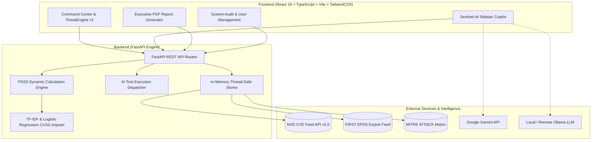

# 🛡️ Vigil.AI-From-Prioritization-to-Autonomous-Agentic-Remediation

### **Adaptive Vulnerability Prioritization Engine & AI & Machine Learning Command Center**
*Empowering SOC analysts, incident response teams, and CISOs to triage, contextualize, and remediate high-impact vulnerabilities using dynamic PSSS scoring, MITRE ATT&CK intelligence, and autonomous AI agents.*

---

[](https://github.com/shreyas23dev/Vigil.AI-From-Prioritization-to-Autonomous-Agentic-Remediation)
[](https://github.com/shreyas23dev/Vigil.AI-From-Prioritization-to-Autonomous-Agentic-Remediation)
[](https://fastapi.tiangolo.com)
[](https://react.dev)
[](https://www.typescriptlang.org)
[](https://vitejs.dev)
[](https://tailwindcss.com)
[](https://www.python.org)
[](https://ai.google.dev)
[](https://ollama.ai)
[](LICENSE)

---

## 📌 Project & Team Summary

| Property | Details |
| :--- | :--- |
| **Project Title** | **Vigil.AI-From-Prioritization-to-Autonomous-Agentic-Remediation** |
| **Team Name** | **Relentless** |

---

## 📑 Table of Contents

- [📌 Project & Team Summary](#-project--team-summary)
- [👥 Team Members](#-team-members)
- [🚨 Problem Statement](#-problem-statement)
- [💡 Solution Overview](#-solution-overview)
- [🛠️ Technology Stack](#️-technology-stack)
- [✨ Key Features](#-key-features)
- [🏗️ Architecture & System Design](#️-architecture--system-design)
- [🧮 The PSSS Scoring Formula](#-the-psss-scoring-formula)
- [⚙️ Setup Instructions](#️-setup-instructions)
  - [Prerequisites](#prerequisites)
  - [Environment Setup](#environment-setup)
  - [One-Click Launch](#one-click-launch)
  - [Manual Execution](#manual-execution)
- [🤖 Sentinel AI Copilot & Tool Calling](#-sentinel-ai-copilot--tool-calling)
- [📡 REST API Reference](#-rest-api-reference)
- [📜 License & Acknowledgements](#-license--acknowledgements)

---

## 👥 Team Members

### **Team: Relentless**

| Name | Role | Focus Areas |
| :--- | :--- | :--- |
| **Shreyas A** | **Team Leader** |
| **Trinath Bhattacharya** | **Team Member** |
| **Samruddhi V Achar** | **Team Member** | 

---

## 🚨 Problem Statement

Modern Security Operations Centers (SOCs) and vulnerability management teams are overwhelmed by the sheer volume of Common Vulnerabilities and Exposures (CVEs) published daily. 

### Key Challenges in Traditional Vulnerability Management:
1. **Alert Fatigue & Overwhelming Backlog**: Thousands of new vulnerabilities emerge each month. Security analysts spend hours sifting through noisy alerts without knowing which vulnerabilities pose immediate existential risk.
2. **Limitations of Static CVSS Scores**: Traditional **Common Vulnerability Scoring System (CVSS)** scores only measure intrinsic technical severity in isolation. A CVSS 9.8 vulnerability with zero real-world exploit availability often draws resources away from a CVSS 7.2 vulnerability actively weaponized by ransomware gangs.
3. **Disconnected AI & Machine Learning Intelligence Feeds**: Exploit prediction statistics (**EPSS**), adversary tactics (**MITRE ATT&CK**), and active Advanced Persistent Threat (**APT**) campaigns are siloed in disparate feeds and rarely synthesized dynamically into operational triage queues.
4. **Slow Manual Triage & Inaction**: Analysts lack autonomous assistance to instantly query vulnerability telemetry, adjust risk weights for unique organization contexts, predict missing CVE vector metrics, and trigger immediate remediation workflows.

---

## 💡 Solution Overview

**Vigil.AI** is an adaptive, intelligence-driven vulnerability prioritization engine and AI & Machine Learning command center built to transform how enterprises triage security risk.

### Core Innovations & Capabilities:

* **Predictive Security Severity Score (PSSS)**: A composite scoring algorithm that unifies intrinsic severity (CVSS), real-world exploitability probability (EPSS), adversary tactic severity (MITRE ATT&CK criticality), and active APT threat actor multipliers into a single actionable 0–10 risk index.
* **Skill Manager & Extensible AI Skills Engine**: Dynamic backend skill execution manager (`skill_manager.py`) supporting action authorization verification (SHA-256 checksums, permission allow-lists, security verification flags), live **Jira/Ticket Dispatcher**, and automated **Sigma/YARA Detection Rule Generation** with ROI Detection Value Scoring.
* **Autonomous Sentinel AI Copilot**: A dual-provider AI agent (powered by **Google Gemini** or local **Ollama** models) equipped with automated function calling to inspect pipeline health, update vulnerability statuses, override priorities, recalibrate formula weights, dispatch Jira tickets, generate Sigma/YARA rules, and render interactive skill cards in the chat UI.
* **Machine Learning Vector Imputer**: Built-in TF-IDF n-gram vectorization and Logistic Regression ML models that predict missing CVSS v3.1 vector metrics (`AV`, `AC`, `PR`, `UI`, `S`, `C`, `I`, `A`) from raw vulnerability text descriptions for zero-day or unclassified CVEs.
* **Interactive ThreatEngine & Analytics**: Real-time MITRE ATT&CK tactic heatmaps with multi-metric interpolation, Top CVE priority rankings, CIA Triad impact breakdowns, and comprehensive APT actor dossiers with one-click IOC copying.
* **Executive & Operational Intel Reports**: Print-ready and exportable PDF intelligence briefings with dark preview mode and customizable modules for leadership and auditors.


---

## 🛠️ Technology Stack

Vigil.AI is architected with a modern, high-performance, and modular technology stack:

### **Frontend & UI Layer**
- **Core Framework**: [React 19](https://react.dev/) (Modern functional components & hooks)
- **Language**: [TypeScript 5.x](https://www.typescriptlang.org/) (Strict type-safety across all data contracts)
- **Build Tool & Dev Server**: [Vite 8.x](https://vitejs.dev/) (Sub-second HMR & optimized production bundling)
- **Styling & UI**: [Tailwind CSS 3.4](https://tailwindcss.com/) with Cyberpunk / SOC dark-mode design system
- **Icons & Visuals**: [Lucide React](https://lucide.dev/) + Custom SVG Charts & MITRE Matrix Colormaps
- **Reporting**: Dynamic CSS `@media print` paper rendering & client-side report generator

### **Backend & APIs**
- **Web Framework**: [FastAPI 0.100+](https://fastapi.tiangolo.com/) (Asynchronous, high-performance REST API)
- **Runtime & Language**: [Python 3.10+](https://www.python.org/)
- **Server**: [Uvicorn](https://www.uvicorn.org/) (Lightning-fast ASGI server)
- **Data Validation & Schemas**: [Pydantic v2](https://docs.pydantic.dev/)

### **Machine Learning & Mathematical Engine**
- **ML Framework**: [scikit-learn](https://scikit-learn.org/) (TF-IDF Vectorizer + Logistic Regression multi-class classifiers)
- **Data Processing**: [NumPy](https://numpy.org/) & [Pandas](https://pandas.pydata.org/) (Vectorized matrix operations & statistical interpolation)

### **Artificial Intelligence & LLM Orchestration**
- **Cloud LLM**: [Google Gemini API](https://ai.google.dev/) (`gemini-2.5-flash`, `gemini-2.5-flash-lite`, `gemini-3.1-flash-lite`, `gemini-3-flash`)
- **Local / Edge LLM**: [Ollama](https://ollama.ai/) (`llama3.2`, `qwen2.5`, `deepseek-r1`, `mistral`)
- **Autonomous Tool Calling**: Custom JSON Schema function-calling dispatcher executing real-time backend state modifications

### **AI & Machine Learning Datasets & Intelligence Feeds**
- **Vulnerability Data**: [NIST National Vulnerability Database (NVD)](https://nvd.nist.gov/) CVE API v2.0
- **Exploit Probability**: [FIRST EPSS (Exploit Prediction Scoring System)](https://www.first.org/epss/)
- **Tactics & Techniques**: [MITRE ATT&CK® Enterprise Matrix](https://attack.mitre.org/)

---

## ✨ Key Features

### 🎛️ 1. Vulnerability Command Center
- **Syncable Priority Queue**: Interactive vulnerability triage queue with initial disorder and one-click sorting by computed PSSS score.
- **Dynamic Filtering & Search**: Instant filtering by lifecycle status (`UNASSIGNED`, `IN_TRIAGE`, `REMEDIATION_PENDING`, `SUPPRESSED`, `RESOLVED`) and severity (`CRITICAL`, `HIGH`, `MEDIUM`, `LOW`).
- **Remediation & Ticket Dispatch**: Actionable remediation modals featuring command-line patch commands, affected cluster node counts, and integration for dispatching Jira / ServiceNow tickets.

### 🗺️ 2. ThreatEngine & Heatmap Analytics
- **MITRE ATT&CK Matrix Heatmap**: Interactive tactic heatmap with Seaborn-style colormaps (`YlOrRd`, `Viridis`, `Magma`, `Rocket`, `Coolwarm`), statistical interpolation, and metric modes (`PSSS`, `EPSS`, `CVSS`, `Exposure`).
- **Top CVE Rankings**: Interactive bar rankings with customizable bar limits, metric selectors, and visual themes (`Amber`, `Flame`, `Cyan`).
- **CIA Triad Impact Breakdown**: SVG pie charts and breakdown metrics quantifying the impact on **Confidentiality**, **Integrity**, and **Availability**.
- **APT Threat Actor Intelligence**: Detailed dossiers on advanced persistent threats (e.g., APT29 Cozy Bear, APT41 Brass Typhoon), target industries, associated CVEs, and one-click IOC clipboard copy.

### 🤖 3. Sentinel AI Autonomous Assistant
- **Dual AI Provider Architecture**: Seamlessly switch between **Google Gemini** and **Ollama Local/Remote Models**.
- **Autonomous Tool Execution**: Sentinel AI is equipped with function-calling capabilities to fetch vulnerabilities, update lifecycle statuses, modify severity/PSSS scores, recalibrate scoring weights, query pipeline health, and predict CVSS vectors from raw vulnerability descriptions.
- **Rich Markdown Formatting**: Generates GitHub-flavored tables, code blocks, structured headers, and interactive prompt shortcut chips.

### 📑 4. Executive & Operational PDF Intel Reports
- **Customizable Report Modules**: Selectable modules including PSSS Score Breakdown, Top Threat Vectors, MITRE ATT&CK Saturation, Remediation SLAs, and Active Adversary Campaigns.
- **Print-Ready Styling**: Dual-theme support with instant Dark Preview and Light Paper print stylesheet (`window.print()`).

### 🔒 5. Enterprise Governance & Telemetry
- **Role-Based Access Control (RBAC)**: User management interface with configurable roles (`CISO_ADMIN`, `TIER_3_LEAD`, etc.), MFA indicators, and permission toggles.
- **Audit Logging**: Comprehensive event tracking for formula weight overrides, status updates, and feed synchronizations with JSON payload modal inspection.
- **Data Pipeline Health**: Real-time status, record synchronization counts, and latency monitoring for NVD, EPSS, and MITRE data streams.

---

## 🏗️ Architecture & System Design



---

## 🧮 The PSSS Scoring Formula

$$
\text{PSSS} = \min\left(10.0, \max\left(0.0, \left(\alpha \cdot \frac{\text{CVSS}_{\text{base}}}{10.0} + \beta \cdot \text{EPSS} + \gamma \cdot \text{Criticality}_{\text{MITRE}}\right) \times 10.0 \times \mu\right)\right)
$$

### Default Weight Distribution
| Parameter | Symbol | Default Value | Description |
| :--- | :---: | :---: | :--- |
| **CVSS Base Weight** | $\alpha$ | `0.35` (35%) | Measures intrinsic technical severity and impact |
| **EPSS Exploit Weight** | $\beta$ | `0.45` (45%) | Measures empirical probability of exploitation in the wild |
| **ATT&CK Criticality** | $\gamma$ | `0.20` (20%) | Threat context boost for critical adversary tactics |
| **Threat Actor Multiplier** | $\mu$ | `1.25` | Multiplier applied when known APT campaigns actively target the CVE |

### Machine Learning Vector Imputer
When vulnerabilities lack published CVSS v3.1 vector strings, the backend ML pipeline employs **TF-IDF n-gram vectorization** combined with **Logistic Regression classifiers** trained on NVD datasets to predict missing metrics (`AV`, `AC`, `PR`, `UI`, `S`, `C`, `I`, `A`) and compute base scores on the fly.

---

## ⚙️ Setup Instructions

### Prerequisites
Before running Vigil.AI, ensure you have the following installed on your machine:
- **Python**: `3.10` or higher
- **Node.js**: `18.x` or higher (`npm` included)
- **Git**: For version control

---

### Environment Setup

1. **Clone the Repository**:
   ```bash
   git clone https://github.com/shreyas23dev/Vigil.AI-From-Prioritization-to-Autonomous-Agentic-Remediation.git
   cd Vigil.AI-From-Prioritization-to-Autonomous-Agentic-Remediation
   ```

2. **Configure Frontend Environment & Security**:
   Copy the example environment file and configure your Gemini API key (stored securely in `.env` which is ignored by `.gitignore`):
   ```bash
   cp frontend/.env.example frontend/.env
   ```
   Edit `frontend/.env`:
   ```env
   VITE_GEMINI_API_KEY=your_gemini_api_key_here
   ```
   > 🔒 **Security Note**: `frontend/.env` is excluded from Git tracking via `.gitignore` (`**/.env`) to ensure API keys and credentials are never exposed or committed.

3. **Install Backend Dependencies**:
   ```bash
   cd backend
   pip install -r requirements.txt
   cd ..
   ```

4. **Install Frontend Dependencies**:
   ```bash
   cd frontend
   npm install
   cd ..
   ```

---

### One-Click Launch

Launches both the FastAPI backend (port `8000`) and the Vite React frontend (port `5173`) concurrently:
```bash
chmod +x launch_local.sh
./launch_local.sh
```

- 🌐 **Web Dashboard**: [http://localhost:5173](http://localhost:5173)
- 🔌 **Backend API**: [http://localhost:8000](http://localhost:8000)
- 📚 **Interactive Swagger API Docs**: [http://localhost:8000/docs](http://localhost:8000/docs)

---

### Manual Execution

If you prefer running services independently across separate terminal windows:

**Terminal 1 — Backend (FastAPI)**:
```bash
cd backend
python3 -m uvicorn main:app --host 0.0.0.0 --port 8000 --reload
```

**Terminal 2 — Frontend (Vite React)**:
```bash
cd frontend
npm run dev
```

---

## 🤖 Sentinel AI Copilot & Tool Calling

Sentinel AI interacts directly with the live threat engine using automated function calling:

| Tool Name | Parameters | Description |
| :--- | :--- | :--- |
| `get_vulnerabilities` | `severity`, `status` | Fetches active CVEs filtered by severity or triage status |
| `get_random_nvd_cves` | `count`, `load_into_triage` | Ingests and prioritizes $N$ CVEs from the NVD dataset |
| `update_vulnerability_status` | `v_id`, `status` | Updates lifecycle status (`UNASSIGNED`, `IN_TRIAGE`, `RESOLVED`, etc.) |
| `update_vulnerability_priority` | `v_id`, `severity`, `psssScore` | Overrides priority rating or sets custom PSSS score |
| `get_threat_actors` | *none* | Fetches active threat actor profiles, IOCs, and target sectors |
| `get_audit_logs` | *none* | Queries system audit trail and security logs |
| `get_pipeline_health` | *none* | Checks NVD, EPSS, and MITRE data ingestion pipeline health |
| `get_scoring_weights` | *none* | Reads current PSSS formula weights ($\alpha, \beta, \gamma, \mu$) |
| `update_scoring_weights` | `cvssWeight`, `epssWeight`, etc. | Recalibrates scoring formula weights on the fly |
| `predict_cve_vector` | `text` | ML model predicts CVSS v3.1 metrics from raw vulnerability text |
| `verify_action` | `action`, `user_role`, `payload`, `checksum` | Verifies action permission allow-list, security flag, and payload SHA-256 checksum |
| `create_jira_ticket` | `cve_id`, `summary`, `priority`, `assignee` | Dispatches Jira remediation ticket via JiraTicketDispatcherSkill |
| `get_jira_tickets` | `cve_id`, `status` | Queries existing remediation tickets |
| `update_jira_ticket` | `ticket_id`, `status` | Updates Jira ticket status |
| `generate_detection_rules` | `cve_id`, `title`, `component`, `is_zero_day` | Generates Sigma YAML and YARA signatures with Detection Value score |
| `execute_skill_patch` | `cve_id`, `repo_url`, `component`, `psss_score` | Inspects codebase, synthesizes AST patch, runs sandbox tests, and opens PR |

---

## 📡 REST API Reference

| Method | Endpoint | Description |
| :--- | :--- | :--- |
| `GET` | `/` | Health check & API version status |
| `GET` | `/api/vulnerabilities` | Retrieve sorted vulnerability priority list |
| `PATCH` | `/api/vulnerabilities/{id}/status` | Update vulnerability lifecycle status |
| `PATCH` | `/api/vulnerabilities/{id}/priority` | Update severity level or PSSS score override |
| `GET` | `/api/threat-actors` | Fetch threat actor dossiers and IOCs |
| `GET` | `/api/audit-logs` | Retrieve recent administrative audit logs |
| `GET` | `/api/users` | List RBAC user accounts and permissions |
| `GET` | `/api/pipeline/health` | Telemetry health metrics for data ingestion feeds |
| `GET` | `/api/weights` | Retrieve current PSSS scoring formula weights |
| `POST` | `/api/weights` | Update PSSS scoring formula weights |
| `POST` | `/api/predict` | Predict CVSS 3.1 vectors and PSSS from text |
| `GET` | `/api/skills` | List registered AI skills and features |
| `POST` | `/api/skills/verify-action` | Verify action permission, security flag, and SHA-256 payload checksum |
| `POST` | `/api/skills/generate-rules` | Synthesize Sigma YAML SIEM rules and YARA signatures for CVEs / zero-days |
| `POST` | `/api/skills/patch` | Execute automated codebase inspection, AST patch, sandbox testing, and PR creation |
| `POST` | `/api/jira/tickets` | Dispatch new Jira remediation ticket |
| `GET` | `/api/jira/tickets` | Query dispatched Jira remediation tickets |
| `PATCH` | `/api/jira/tickets/{ticket_id}/status` | Update Jira remediation ticket status |
| `GET` | `/api/agent/tools` (and `/api/agents/tools`) | Retrieve OpenAI/Gemini compatible function calling schemas |
| `POST` | `/api/agent/execute-tool` (and `/api/agents/execute-tool`) | Execute backend tool on behalf of AI agent with skill verification |

---

## 📜 License & Acknowledgements

This project is licensed under the **MIT License** — see the [LICENSE](LICENSE) file for details.

### Frameworks & Intelligence Sources
- **[CVSS v3.1 Specification](https://www.first.org/cvss/)** — Forum of Incident Response and Security Teams (FIRST)
- **[EPSS (Exploit Prediction Scoring System)](https://www.first.org/epss/)** — FIRST & Cyentia Institute
- **[MITRE ATT&CK®](https://attack.mitre.org/)** — MITRE Corporation
- **[National Vulnerability Database (NVD)](https://nvd.nist.gov/)** — NIST
